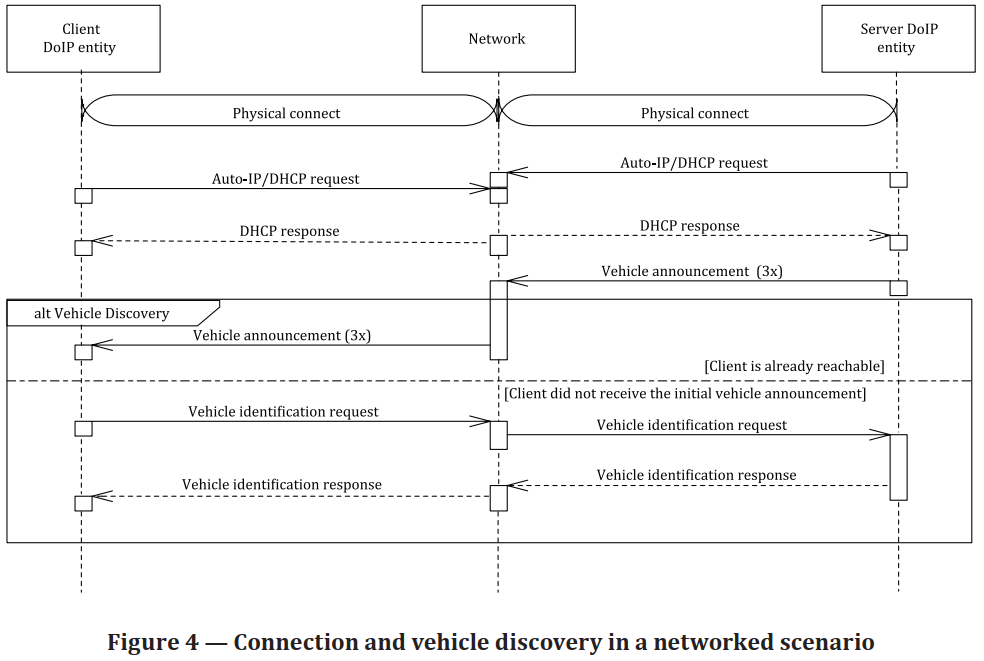
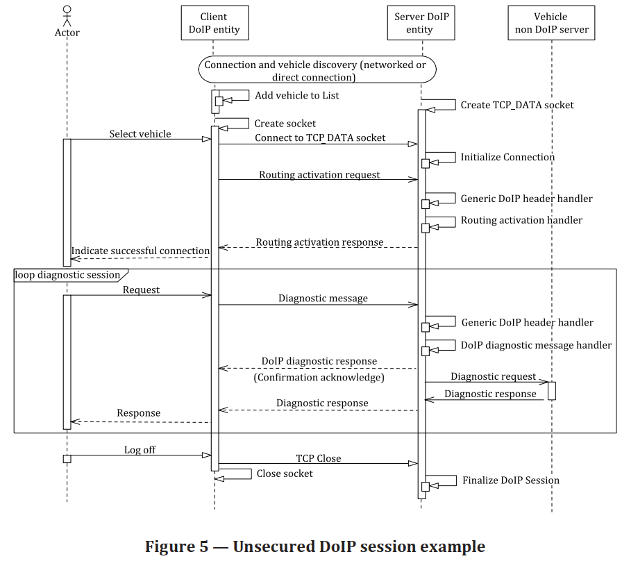
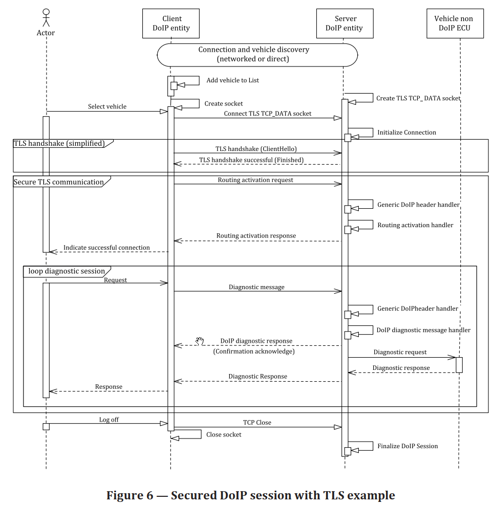
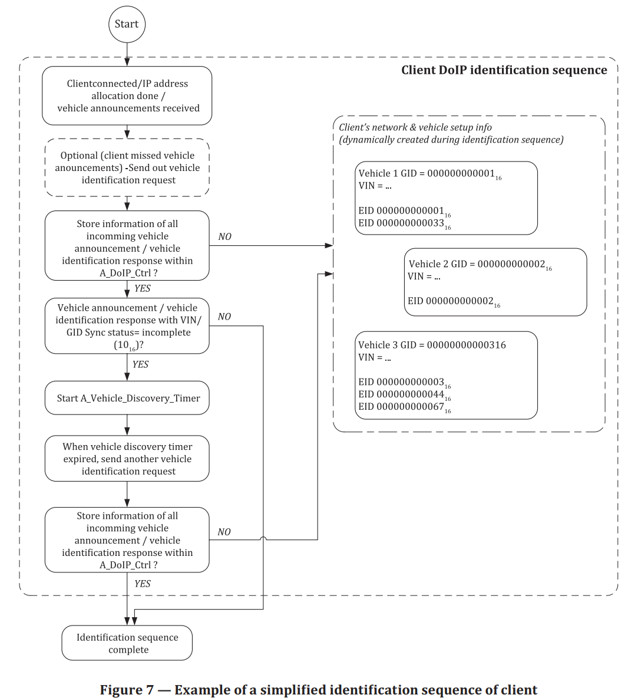
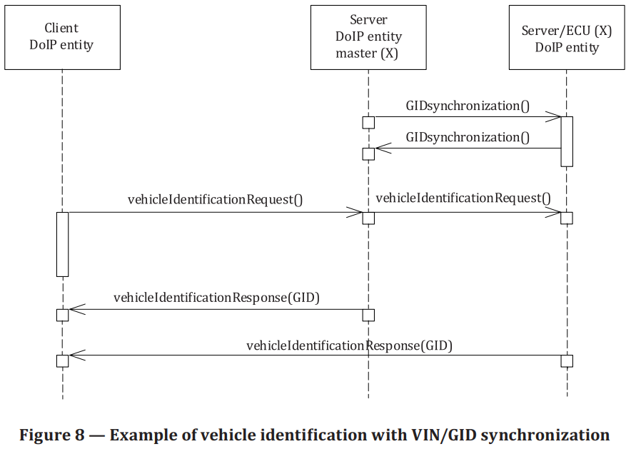
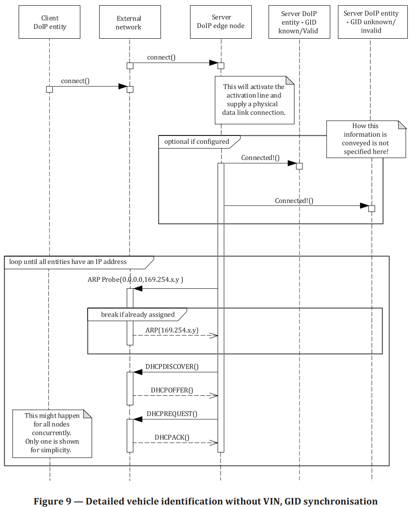

# DoIP
## Connection establishment and vehicle discovery
### Direct connect scenario

1. physical connect: crossover ethernet.
2. no DHCP server is present.
3. (UDP, 3 TIMES)Server -> Client: SEND Vehicle announcement message = VIN + EID + GID + logical address
4. If client didn't receive the initial vehicle announcement message
   1. Client -> Server : Vehicle identification request
   2. Server -> Client : Vehicle identification response

### network connect scenario

1. network connect

### Unsecured DoIP session

### Secured DoIP session

## Vehicle network integration
### Vehicle identification
1. Group ID
### Multiple vehicles in a single network

## Requirement
1. GID synchronization

